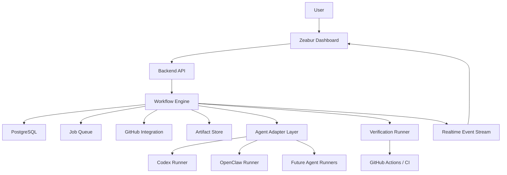
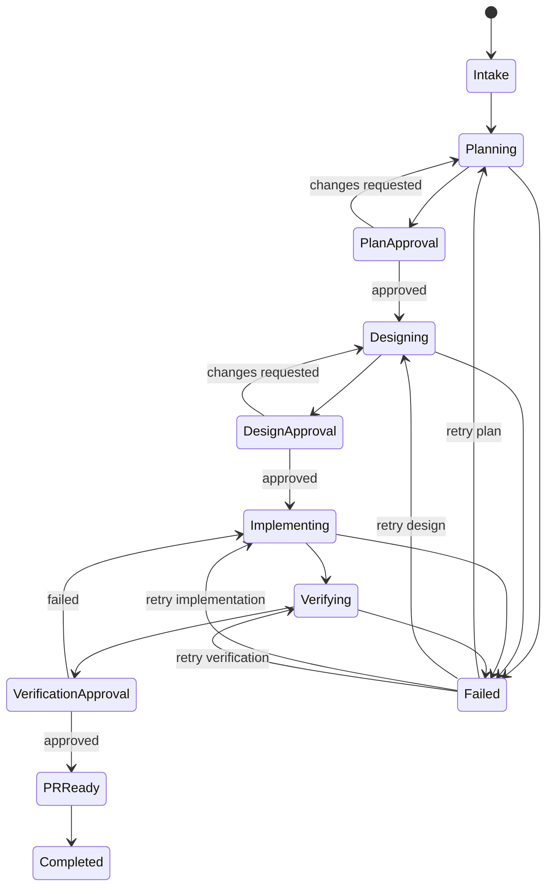

# Harness Framework Architecture Plan

## Decision

Adopt **Option B: Dashboard Backend + Workflow Engine centered architecture**.

The dashboard/backend owns workflow state, human approvals, agent selection, artifact tracking, and realtime progress. GitHub remains the source of truth for repository state, issues, pull requests, branches, and CI checks. Codex, OpenClaw, and future coding agents are integrated through replaceable agent adapters.

## Goal

Build an AI software delivery harness that coordinates the full development workflow:

1. Plan
2. Design
3. Implementation
4. Verification
5. Human approval
6. GitHub PR delivery

Each major step must support three execution modes:

- `manual`: human performs or approves the step.
- `agent`: selected agent performs the step automatically.
- `hybrid`: agent drafts or executes, human approves before continuing.

## Core Principles

1. The workflow engine is the product core; agents are replaceable workers.
2. GitHub owns code, issues, PRs, branches, and CI results.
3. The dashboard owns orchestration, visibility, and approval gates.
4. Every important output is persisted as an artifact.
5. Every workflow run must be resumable, auditable, and partially rerunnable.
6. The workflow is an event-driven skill chain; each development action has an explicit trigger, actor, constraint set, artifact output, and gate.

## Architecture



## System Components

### Dashboard

Responsibilities:

- Create development requests.
- Select target repository and branch policy.
- Select execution mode per stage.
- Select development agent.
- Configure approval actors for design review and verification review.
- Show workflow progress in realtime.
- Show artifacts, logs, PR links, test results, and approval gates.
- Allow human approve, reject, retry, or request changes.

Recommended stack:

- Next.js or Remix frontend.
- WebSocket or Server-Sent Events for progress streaming.
- Zeabur deployment.

### Backend API

Responsibilities:

- Expose project, workflow, artifact, and approval APIs.
- Validate user actions.
- Persist workflow state.
- Authenticate GitHub and agent-provider credentials.
- Dispatch jobs into the workflow engine.

Recommended stack:

- TypeScript + Node.js, or Python + FastAPI.
- PostgreSQL for state.
- Redis/BullMQ, Temporal, or similar queue/workflow runtime.

### Workflow Engine

Responsibilities:

- Own the state machine.
- Decide next step after each event.
- Enforce approval gates.
- Resolve whether each approval gate is handled by a human, a verification subagent, or an independent reviewer agent.
- Dispatch one bounded event skill at a time.
- Resolve the assigned executor for each event skill from `skillAssignments`.
- Persist event constraints as snapshots so later review can see what rules the agent received.
- Route work to the selected agent adapter.
- Retry failed steps safely.
- Persist every transition.

The workflow engine should not contain Codex/OpenClaw-specific logic. It should only call an adapter contract.

### Event Skill Chain

The workflow is not only a sequence of stages. It is a sequence of event skills. Each event skill defines:

- Trigger
- Stage
- Assigned executor
- Allowed actors
- Inputs
- Outputs
- Constraints
- Gates
- Knowledge sources
- Verification rules

Default event skills:

- `intake.requirement`
- `plan.interview`
- `plan.approval`
- `design.openspec`
- `design.approval`
- `implementation.dispatch`
- `verification.generate`
- `verification.approval`
- `closeout.archive`

This follows the local development-skill pattern: the skill body limits what the agent may do, identifies what knowledge it may use, and defines what evidence must exist before the workflow advances.

`omx_wiki` is the canonical local knowledge source for durable project memory, including architecture decisions, conventions, testing patterns, debugging notes, and session logs.

The workflow-level `selectedAgent` is only the default executor. The dashboard must let users assign `codex`, `openclaw`, or `manual` to each individual event skill. Runtime events and agent run records use the per-skill assignment, not the workflow-level default.

### GitHub Integration

Responsibilities:

- Read issues as requirement sources.
- Create branches.
- Create or update pull requests.
- Trigger GitHub Actions.
- Read CI status and coverage artifacts.
- Comment status updates back to issues or PRs.

GitHub should be treated as SCM/CI, not as the workflow brain.

### Agent Adapter Layer

Responsibilities:

- Normalize calls to Codex, OpenClaw, and future agents.
- Provide a shared input/output contract.
- Isolate agent-specific auth, CLI, runtime, and log parsing.

Common adapter interface:

```ts
interface AgentAdapter {
  name: "codex" | "openclaw" | string
  capabilities: AgentCapability[]
  run(task: AgentTask): Promise<AgentRunResult>
  cancel(runId: string): Promise<void>
}
```

### Verification Runner

Responsibilities:

- Generate or run tests.
- Execute lint, typecheck, unit tests, integration tests, and coverage.
- Map verification results back to acceptance criteria.
- Produce machine-readable and human-readable reports.

## Workflow State Machine



## Stage Contracts

### Plan

Inputs:

- Requirement text.
- GitHub issue URL or issue body.
- Repository context.
- User-selected constraints.

Outputs:

- Requirement summary.
- Open questions.
- Acceptance criteria.
- Risk list.
- Proposed implementation scope.
- Plan artifact.

Approval gate:

- Human can approve, reject, or request clarification.

### Design

Inputs:

- Approved plan.
- Repository context.
- Existing architecture references.

Outputs:

- OpenSpec change.
- Technical design.
- API/data model proposal.
- Task breakdown.
- Verification strategy.

Approval gate:

- Human, verification subagent, or independent reviewer agent can approve, reject, or request redesign.
- The preferred default is an independent reviewer agent when the implementation agent also produced the design.

### Implementation

Inputs:

- Approved design.
- Target repository.
- Target branch.
- Agent selection.

Outputs:

- Branch.
- Commits.
- Pull request.
- Implementation notes.
- Agent logs.

### Verification

Inputs:

- PR branch.
- Acceptance criteria.
- Test strategy.

Outputs:

- Generated tests.
- Test run results.
- Coverage report.
- Manual verification checklist.
- Final verification decision.

Approval gate:

- Human, verification subagent, or independent reviewer agent can approve, fail, or request implementation changes.
- The gate actor should be configurable per project and per run.
- For higher-risk changes, prefer an independent reviewer agent that did not implement the code.

## Data Model

```ts
type WorkflowStatus =
  | "pending"
  | "running"
  | "waiting_for_human"
  | "failed"
  | "completed"

type WorkflowStage =
  | "intake"
  | "plan"
  | "design"
  | "implementation"
  | "verification"
  | "completed"

type ExecutionMode = "manual" | "agent" | "hybrid"

type AgentKind = "codex" | "openclaw" | "manual"

type ApprovalActorType = "human" | "verification_subagent" | "independent_agent"

interface ApprovalPolicy {
  stage: WorkflowStage
  actorType: ApprovalActorType
  agent?: AgentKind
  requireIndependence: boolean
}

interface WorkflowEventSkill {
  id: string
  eventType: WorkflowEventType
  stage: WorkflowStage
  name: string
  purpose: string
  trigger: string
  allowedActors: Array<AgentKind | ApprovalActorType>
  inputs: string[]
  outputs: string[]
  constraints: string[]
  gates: string[]
  knowledgeSources: string[]
  verificationRules: string[]
}

interface WorkflowEvent {
  id: string
  workflowRunId: string
  skillId: string
  eventType: WorkflowEventType
  stage: WorkflowStage
  status: "pending" | "running" | "waiting_for_gate" | "completed" | "failed"
  actor: string
  inputArtifactIds: string[]
  outputArtifactIds: string[]
  constraintsSnapshot: string[]
  note?: string
  createdAt: string
  completedAt?: string
}

interface WorkflowRun {
  id: string
  projectId: string
  repositoryId: string
  source: "dashboard" | "github_issue" | "github_pr"
  sourceRef?: string
  currentStage: WorkflowStage
  status: WorkflowStatus
  selectedAgent: AgentKind
  stageModes: Record<WorkflowStage, ExecutionMode>
  skillAssignments: Record<string, AgentKind>
  approvalPolicies: ApprovalPolicy[]
  eventSkills: WorkflowEventSkill[]
  events: WorkflowEvent[]
  createdAt: string
  updatedAt: string
}

interface Artifact {
  id: string
  workflowRunId: string
  stage: WorkflowStage
  type:
    | "requirement"
    | "plan"
    | "openspec"
    | "design"
    | "patch"
    | "test_report"
    | "coverage_report"
    | "manual_checklist"
    | "log"
  uri: string
  summary?: string
  createdAt: string
}

interface ApprovalGate {
  id: string
  workflowRunId: string
  stage: WorkflowStage
  status: "pending" | "approved" | "rejected" | "changes_requested"
  requestedBy: "system" | "agent" | "human"
  actorType: ApprovalActorType
  assignedAgent?: AgentKind
  requireIndependence: boolean
  decidedBy?: string
  decisionNote?: string
  createdAt: string
  decidedAt?: string
}

interface AgentRun {
  id: string
  workflowRunId: string
  stage: WorkflowStage
  agent: AgentKind
  status: WorkflowStatus
  inputArtifactIds: string[]
  outputArtifactIds: string[]
  startedAt?: string
  finishedAt?: string
}
```

## API Surface

Minimum backend API:

- `POST /projects`
- `GET /projects/:id`
- `POST /workflow-runs`
- `GET /workflow-runs/:id`
- `POST /workflow-runs/:id/start`
- `POST /workflow-runs/:id/cancel`
- `POST /workflow-runs/:id/retry`
- `GET /workflow-runs/:id/events`
- `GET /workflow-runs/:id/artifacts`
- `POST /approval-gates/:id/approve`
- `POST /approval-gates/:id/reject`
- `POST /approval-gates/:id/request-changes`
- `POST /github/webhook`
- `POST /github/repositories/:id/dispatch`

## MVP Scope

### M0: Manual Workflow Skeleton

Acceptance criteria:

- User can create a project.
- User can create a workflow run from dashboard text input.
- Workflow run progresses through plan, design, verification as manual steps.
- Dashboard shows current stage and status.
- Approval gates work.
- Design and verification approval gates can be assigned to a human, verification subagent, or independent reviewer agent.
- Dashboard shows the configured event skill chain and each skill's constraints.

### M1: GitHub Integration

Acceptance criteria:

- User can connect a GitHub repository.
- User can create a workflow run from a GitHub issue.
- Backend can create a branch and PR.
- Backend can receive GitHub webhook updates.
- Dashboard shows PR and CI status.

### M2: Codex Adapter

Acceptance criteria:

- Codex can generate a plan artifact.
- Codex can generate or update an OpenSpec artifact.
- Codex can create implementation changes on a branch.
- Codex logs and outputs are persisted as agent artifacts.

### M3: Verification Harness

Acceptance criteria:

- System can run lint, typecheck, tests, and coverage.
- System can generate a verification report.
- Verification report links test results to acceptance criteria.
- Human or configured reviewer agent can pass or fail the verification checklist.

### M4: OpenClaw Adapter

Acceptance criteria:

- OpenClaw can be selected as an agent.
- OpenClaw runs through the same adapter interface as Codex.
- Workflow engine does not need OpenClaw-specific stage logic.

## Recommended Technology Choices

For an MVP:

- Frontend: Next.js
- Backend: Next.js API routes for very small MVP, or FastAPI/NestJS for cleaner service separation
- Database: PostgreSQL
- Queue: Redis + BullMQ, or Temporal if long-running workflows become central
- Realtime: Server-Sent Events first, WebSocket later if bidirectional control is needed
- Hosting: Zeabur
- SCM/CI: GitHub + GitHub Actions
- Agent execution: isolated runner container or GitHub Actions runner

Recommended first implementation:

- Use Next.js + PostgreSQL + BullMQ.
- Keep runner jobs in backend workers.
- Trigger GitHub Actions only for CI and repository-side checks.
- Add Temporal later if retries, compensation, and long-running orchestration become complex.

## Key Risks

### Risk: Agent lock-in

Mitigation:

- Keep Codex/OpenClaw behind `AgentAdapter`.
- Persist normalized artifacts, not raw agent-specific output only.

### Risk: Workflow state split across Dashboard and GitHub Actions

Mitigation:

- Backend is the state authority.
- GitHub Actions reports events back to backend.
- Never infer source of truth from GitHub Actions alone.

### Risk: Long-running jobs fail mid-stage

Mitigation:

- Persist stage checkpoints.
- Make each stage idempotent.
- Use retryable job records.

### Risk: Generated tests validate implementation instead of requirement

Mitigation:

- Store acceptance criteria as first-class data.
- Require verification report to map tests to acceptance criteria.
- Keep manual verification gate for high-risk changes.

### Risk: Dashboard becomes only a log viewer

Mitigation:

- Make approval gates, retry controls, artifact review, and agent selection first-class dashboard features.

## Alternative Considered

### GitHub Actions as workflow engine

Rejected for product-core orchestration because GitHub Actions is strong for CI and short-lived automation, but weaker for long-running, user-interactive, resumable workflows with rich dashboard state.

### OpenClaw as workflow controller

Rejected as the core architecture because it would make the product too dependent on one assistant runtime. OpenClaw should be an adapter, not the workflow authority.

## Definition of Done for First Usable Version

The first usable version is complete when:

- A user can submit a requirement from the dashboard.
- The system can create a workflow run.
- The run can pass through plan, design, and verification stages.
- Each stage can be manual, agent-driven, or hybrid.
- Approval gates are enforced for both human and configured agent reviewers.
- GitHub branch and PR integration works.
- At least one agent adapter, preferably Codex, can produce artifacts.
- Verification results are visible in the dashboard.
- Failed stages can be retried without losing prior artifacts.

## Next Implementation Plan

1. Create repository scaffold.
2. Define database schema and workflow state machine.
3. Build dashboard pages for projects and workflow runs.
4. Build backend APIs for workflow creation, stage transitions, artifacts, and approvals.
5. Add GitHub app or token-based GitHub integration.
6. Add queue worker and workflow engine.
7. Add Codex adapter.
8. Add verification runner.
9. Add OpenClaw adapter after the adapter contract stabilizes.
