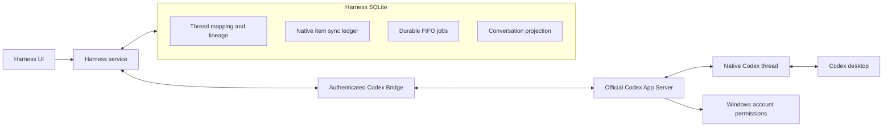
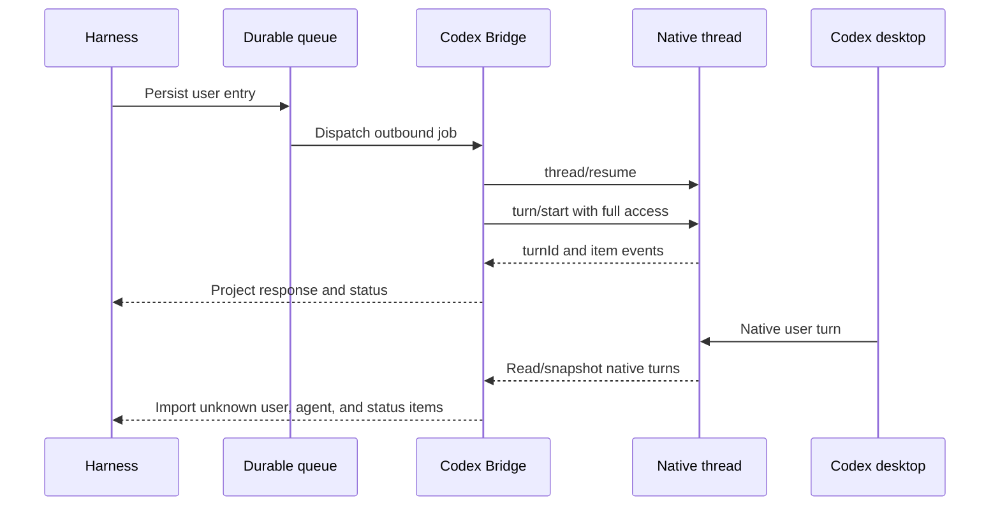
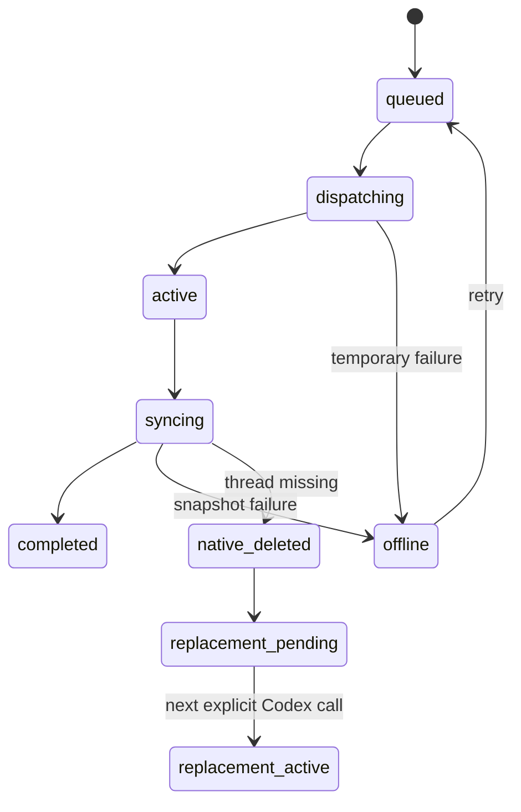

# Harness ↔ Codex Native Thread Synchronization

Status: design approved in conversation; awaiting written-spec review before implementation.

Date: 2026-08-23

Branch: `dev`

## Intent

When a Harness conversation invokes Codex, Harness must create or resume one
corresponding native Codex App Server thread. The thread must be visible in the
Codex desktop sidebar without taking focus. Messages, Codex replies, and
relevant execution state must synchronize in both directions while preserving
one durable conversation identity and the existing full-device execution mode.

## Confirmed product decisions

- Codex sidebar discovery is required; automatic focus or foregrounding is not.
- One Harness conversation has one active native Codex thread.
- The same native thread is resumed after Bridge/process restart.
- A replacement is created only after confirmed deletion or unrecoverable
  native-thread failure, and the replacement retains lineage and shows a
  warning.
- Full access means unsandboxed execution under the Windows account that runs
  the Bridge. The feature does not request UAC elevation or require
  Administrator launch.
- Synchronization is bidirectional. Harness-originated messages, native Codex
  replies, Codex-originated messages, and relevant execution state are
  projected across both surfaces.
- The native Codex thread is authoritative for Codex transcript content.
- Harness SQLite owns durable mapping, lineage, FIFO queue, synchronization
  ledger, cursors, and the UI projection.
- Healthy synchronization target is 30 seconds. Token-by-token mirroring is
  not required.
- One native thread has at most one active turn. Later messages use a durable
  FIFO queue; automatic steer and interrupt are not used.
- Temporary Bridge or network failure retains the queue and retries. It never
  creates a replacement thread.
- Thread names are Harness-owned and use `Harness · <conversation title>`.
  Harness renames update Codex; Codex-side renames do not overwrite Harness.
- Archive/unarchive synchronizes both ways.
- Confirmed Harness deletion deletes the Harness conversation and native thread.
  Codex-side deletion retains the Harness projection until the next Codex
  invocation, when a warned replacement may be created.
- Existing conversations migrate lazily on their next Codex invocation; no
  eager bulk migration is required.
- Delivery and verification are limited to `dev`; no production/main release
  is part of this change.

## Architecture



The native Codex thread is the canonical Codex transcript. Harness does not
read private Codex JSONL or SQLite storage and the Bridge does not grow a
second durable conversation database. The Bridge is an authenticated adapter
that owns App Server transport and in-memory process handles; after restart it
reopens the persisted thread supplied by Harness.

## Durable state

Extend the existing conversation/session persistence rather than creating a
parallel conversation subsystem.

### Thread mapping

The mapping must retain at least:

- Harness `conversationId`
- active native `threadId`
- current Bridge session id, when loaded
- mapping state: active, offline, native-deleted, replacement-pending,
  replacement-active
- previous/replaced thread id and replacement reason
- Harness title and last native-name synchronization time
- last native turn/item cursor or equivalent recovery marker
- created and updated timestamps

The existing Bridge session id is not the durable identity. The native
`threadId` is.

### Synchronization ledger

Use stable native identity for idempotency:

```text
(nativeThreadId, nativeTurnId, nativeItemId)
    -> harnessEntryId / statusRecord / origin / importedAt
```

Ledger records must distinguish Harness-originated native turns from turns
created directly in Codex desktop. A Harness-originated native user item is
synthetic transport context and must not be inserted again as a new Harness
user message.

### Outbound queue

Reuse the existing durable conversation dispatch/execution-job mechanism where
possible. Each queued item must carry its source Harness entry, target thread,
idempotency key, attempt state, and next retry time. A per-thread lease allows
only one Harness dispatch at a time.

## Bidirectional synchronization



Rules:

1. Persist the Harness user entry before dispatching to native Codex.
2. Resume or create the mapped thread, set the Harness-owned name, and apply
   the full permission policy.
3. Record the native `turnId` as soon as `turn/start` returns.
4. Track the native user item as outbound/synthetic so the shared transcript
   and the original Harness entry are not duplicated.
5. Import unknown native user messages as Harness entries using an idempotency
   key derived from native thread/turn/item identity.
6. Import native agent messages and terminal turn states using the same ledger.
7. Consume live events when available and periodically read a native snapshot
   for missed-event recovery. Use stable `thread/read(includeTurns: true)` as a
   compatibility baseline; use `thread/turns/list` only when the installed
   App Server version supports the required experimental capability.
8. A server-side worker must continue synchronization without an open browser
   page and meet the 30-second healthy-connection target.
9. If the Bridge crashes after native `turn/start` accepted the turn but before
   the ledger write completes, recovery must inspect native history and match
   the pending outbound job before retrying. It must never blindly resend.

## Recovery and concurrency



- Bridge restart calls `thread/resume` using the durable native thread id.
- Temporary failures keep the same mapping and queue, use retry/backoff, and
  display waiting-for-sync state.
- A confirmed missing/deleted thread is not replaced until the next explicit
  Codex invocation.
- Replacement creates a new mapping and preserves the previous thread id,
  reason, timestamp, and warning.
- Harness uses a per-thread database lease to serialize its own dispatches.
- A native Codex turn discovered during synchronization blocks later Harness
  dispatches until the native turn reaches a terminal state.
- Do not use `turn/steer` or automatic interruption.
- The installed Codex version must be tested with two App Server clients
  competing for one thread. The implementation may rely on native rejection or
  serialization only after that test proves it. If two turns can both be
  accepted, stop and resolve the conflict before weakening the FIFO contract.

## Security boundary

- Preserve authenticated Bridge access and the existing repository-origin
  guard.
- Apply `dangerFullAccess` only for the explicit Codex full permission profile.
- Do not elevate UAC, require Administrator, bypass Windows ACLs, or expose
  Bridge/site credentials.
- Treat native Codex text imported into Harness as untrusted content; it cannot
  override workflow policy, authorization, or synchronization rules.
- Require explicit confirmation before Harness-side deletion of both stores.
- Use only controlled, reversible test commands for full-access validation.

## Verification plan

### Unit tests

- Create/resume mapping and replacement lineage.
- Native identity ledger idempotency.
- Suppression of Harness synthetic context.
- Import of Codex-originated turns and statuses.
- FIFO queue, lease, retry/backoff, and offline persistence.
- Name, archive, unarchive, and deletion rules.
- Full permission payload and no-admin behavior.

### Integration tests

- Fake App Server protocol for start, resume, read, turn events, missing
  events, deletion, and terminal errors.
- Recovery after the native turn is accepted before the ledger write.
- Two-client single-active-turn behavior against the installed Codex version.
- Bridge restart with the same native thread id.

### Local end-to-end

- Harness creates a Codex conversation and the Codex thread appears in the
  desktop sidebar.
- Harness does not focus or foreground the Codex desktop app.
- Harness and Codex desktop messages synchronize in both directions within the
  30-second target.
- Offline queue survives restart and retries without replacement.
- Native deletion creates a warned replacement only on the next invocation.
- Full-access test performs only a controlled workspace-safe operation.

### Dev deployment and browser verification

1. Work from the existing `dev` worktree.
2. Run focused tests, full tests, typecheck, lint, build, and changed-code
   security review.
3. Deploy the dev service to `harness-framework-dev.zeabur.app`.
4. Use the in-app browser to operate the dev site and observe the conversation
   UI, sync statuses, and Codex-related state.
5. Use the supplied Zeabur service page to verify the deployed revision,
   Bridge URL/token configuration, and health.
6. Capture browser evidence for first creation, sidebar visibility,
   bidirectional sync, offline/retry, and replacement warning.

## Acceptance criteria

1. First Codex invocation creates one non-ephemeral native thread, stores the
   mapping, sets `Harness · <title>`, and makes it discoverable in Codex history.
2. Thread creation does not navigate or foreground Codex desktop.
3. Full mode uses unsandboxed Windows-user execution without UAC elevation.
4. Bridge restart resumes the stored native thread instead of creating a second.
5. Confirmed native deletion creates one lineage-linked replacement only on the
   next Codex invocation and shows a warning.
6. Harness-originated messages and native results project without duplicates.
7. Codex-desktop-originated user messages, replies, and terminal state appear
   in Harness within 30 seconds while healthy.
8. Repeated synchronization preserves native ordering and is idempotent.
9. One active turn is enforced per thread; later messages are durable FIFO.
10. Temporary unavailability retains and retries messages without replacement.
11. Harness rename updates Codex; Codex rename does not overwrite Harness.
12. Archive/unarchive synchronizes both ways.
13. Confirmed Harness deletion deletes both stores; native deletion preserves
   Harness history until replacement is requested.
14. Existing conversations migrate lazily on their next Codex invocation.

## Implementation gate

Do not begin implementation until this written design is reviewed by the user
and any requested changes are incorporated.
