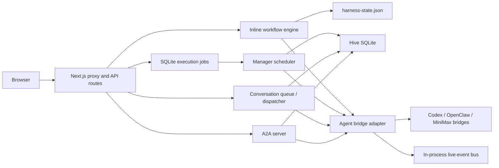

# Harness Architecture Audit and Risk Register

## Scope and confidence

This page records a code-grounded scan of the Harness workspace as of
2026-08-22. The runnable application is `repos/jormungand/`; the root
workspace owns `raw/`, `wiki/`, `spec/`, `graphify/`, and generated artifacts.
`elle_amr_src/` is a separate nested Git repository with its own branch and
working-tree changes, so it is treated as an external target repository rather
than part of the Harness control plane.

The findings below use three labels:

- **Evidence** — directly visible in code, configuration, tests, or generated
  artifacts.
- **Inference** — the operational consequence most strongly implied by that
  evidence.
- **Unknown** — not established by this repository scan.

## Current topology

The system therefore has three execution shapes:

1. Normal workflow runs call `advanceWorkflow` inline from the API route.
2. Managed runs and `agent_task` runs use durable SQLite execution jobs and a
   manager scheduler.
3. Conversations use a durable queue in the newer path, while Codex session
   handling, unbound routing, and A2A dispatch retain direct bridge calls.

## Ranked architecture risks

| Rank | Finding | Confidence | Why it matters |
| --- | --- | --- | --- |
| P0 | Workflow state and control-plane state are split across JSON and SQLite without a cross-store transaction. | High | A workflow run, execution job, manager task, wake, conversation, or audit record can be committed in different orders. Recovery can produce a run that exists in one store but has no corresponding job or history. |
| P0 | Locks, live events, bridge sessions, and in-flight A2A work are process-local. | High | Restarting a process loses coordination state; multiple replicas do not share the same locks, event bus, bridge journals, or session maps. |
| P0 | Long-running work is still coupled to synchronous HTTP in multiple paths. | High | Proxy timeout, retry, or client disconnect can leave the external executor running while the application is still reconciling the result. |
| P1 | Workflow orchestration is concentrated in a large module and validates many agent results through text conventions rather than typed event contracts. | High | Stage semantics, skill catalog, approval policy, revision handling, artifact recording, and executor calls evolve together; a malformed or overly optimistic report can look like a passing review. |
| P1 | Permission mode is ambient process configuration rather than a persisted run-level authorization snapshot. | High | The same run can observe a different gate/sandbox policy after configuration changes; the Hive singleton captures the mode at service construction while some routes read it per request. |
| P1 | The persistence repository and shared types span memory, conversation, A2A, manager, and job domains. | High | The system has one physical SQLite file but weak logical boundaries, making migration, ownership, and failure isolation harder as features grow. |
| P2 | Documentation and generated architecture evidence lag current code, and two wiki roots are active. | High | `wiki/`, `omx_wiki/`, `spec/`, C4 output, and Graphify can describe different versions of the same system. |
| P2 | The verification baseline is not clean on the current Windows workspace. | High | Typecheck and build pass, but the package test script does not expand its glob on Windows and the explicit test run reports 358 passing / 29 failing tests. |

## Evidence and inference

### 1. Split persistence and recovery atomicity

**Evidence:** `repos/jormungand/lib/store.ts:13-14,79-94,133-188` serializes
JSON state writes and applies optimistic versions only inside the process.
`repos/jormungand/lib/hive-memory/schema.ts:141-165,195-245,253-271` stores
conversations, A2A audit, and execution jobs in a separate SQLite schema.
`repos/jormungand/app/api/projects/[id]/workflow-runs/route.ts:108-169`
creates an execution job, persists the workflow run, creates a manager task,
and enqueues a manager wake as separate operations. The backup script reads
`harness-state.json` before the SQLite online backup and copies the JSON after
the SQLite backup at `repos/jormungand/scripts/backup-hive-memory.mjs:21-43`.

**Inference:** A shared data directory and paired filenames improve operations,
but they do not make the two stores one transaction or one point-in-time
snapshot. This is a broader form of the accepted JSON-store debt in
[[wiki/concepts/tech-debt-json-state-persistence]].

**Unknown:** The repository does not prove whether the deployed platform runs
one process permanently or whether an external operator reconciles orphaned
JSON/SQLite records after failure.

### 2. Process-local coordination

**Evidence:** `store.ts:13-14,206-218,311-317` has process-local write and
per-run queues. `hive-memory/database.ts:22-27,72-91` has a process-local
SQLite write queue. `manager-scheduler.ts:37-58` locks manager cycles in a
module-level map. `agent-live-bus.ts:68-174` keeps the live snapshot and
listeners in memory. The bridge scripts also keep active/completed runs and
sessions in maps, for example `scripts/codex-bridge.mjs:30-35` and
`scripts/openclaw-bridge.mjs:56-61`.

**Inference:** The durable SQLite queue can recover database rows, but it
cannot by itself recover a lost in-flight bridge session, live stream, or
process-local lock. The current design is coherent for a bounded single
instance, not for transparent horizontal scaling or restart-safe live work.

### 3. Synchronous transport and multiple execution semantics

**Evidence:** Normal workflow creation and advance call `advanceWorkflow` in
the request path at
`repos/jormungand/app/api/workflow-runs/route.ts:115-122` and
`repos/jormungand/app/api/workflow-runs/[id]/advance/route.ts:41-50`.
`agent-bridge.ts:167-245` waits for the bridge POST, and
`agent-bridge.ts:283-329` performs recovery polling inside the same invocation.
The A2A server persists a task but calls its dispatcher inline at
`a2a-server.ts:331-470`. By contrast, managed and `agent_task` starts use
`execution_jobs` in `app/api/projects/[id]/workflow-runs/route.ts:108-201`.

**Inference:** “Durable job”, “inline workflow”, “conversation queue”, and
“A2A task” are not one execution contract. Retry and cancellation behavior
depends on which route and project type was selected. This extends the known
transport debt in [[wiki/concepts/tech-debt-synchronous-bridge-transport]].

### 4. Workflow contract concentration

**Evidence:** `workflow.ts` is 2,059 lines and contains the default/custom
skill catalogs, run creation, all stage transitions, approval/revision logic,
artifact recording, and event-log checks. The main state machine is
`workflow.ts:746-1180`; artifact normalization and agent-run recording are
`workflow.ts:1877-2007`. Review output in the default path is represented by
text such as `Blocking findings: no` and severity counts at
`workflow.ts:855-896,998-1034,1073-1137`.

**Inference:** The current audit trail is useful, but the runtime does not
enforce a typed result schema for each event skill. It mostly records the
agent body, checks status, and looks for blocking strings. That creates a
large semantic surface where prompt conventions and parser behavior can drift
without a corresponding contract failure.

### 5. Ambient permission mode

**Evidence:** `advanceWorkflow` receives a process-derived permission mode and
bypasses plan/design/verification gates in `workflow.ts:764-765,890-905,
939-954,1123-1172`. The bridge reads the current mode again when constructing
the external request at `agent-bridge.ts:190`. `createHiveServices` captures
the mode at construction in `hive-services.ts:45-58`, while route handlers
often call `getAgentPermissionMode()` for each request.

**Inference:** A long-lived run has no persisted authorization snapshot in
`WorkflowRun`; behavior can change when the process environment or service
instance changes. This is especially important because `full` changes both
workflow gates and executor sandbox/approval behavior.

### 6. Domain boundary erosion

**Evidence:** `hive-memory/repository.ts` is a 2,124-line repository covering
memory lifecycle, conversations, manager state, A2A audit, and execution jobs;
the same table family is defined in `hive-memory/schema.ts`. The central
`types.ts` also carries workflow, manager, A2A-adjacent, permissions, artifact,
and runtime-skill contracts.

**Inference:** The SQLite file is durable, but the logical architecture is a
single control-plane repository with many feature-specific callers. The next
schema or policy change is likely to have a wider blast radius than the C4
container view suggests.

### 7. Documentation and graph freshness

**Evidence:** `repos/README.md:34-52` and `zbpack.json:1-3` identify
`repos/jormungand/` as the application root, while the root `README.md` still
shows bare `npm run ...` commands and the root contains a separate two-route
`app/api/` tree. The curated `wiki/index.md:94-97` already says Graphify and
C4 evidence was last regenerated on 2026-08-13 and does not reflect A2A,
hive memory, or the manager scheduler. `graphify/jormungand-root/GRAPH_REPORT.md:1-10`
was built from commit `52a020e`, while the current checkout is newer.
`omx_wiki/` is a second, much smaller knowledge base used by event-skill
prompts.

**Inference:** The repository has a clear intended source of truth, but stale
root surfaces and parallel knowledge stores increase the chance that an agent
reads the wrong contract. This audit is therefore linked from both wiki
indices, while generated C4/Graphify assets remain explicitly marked as stale.

## Verification snapshot

- `npm run typecheck`: passed.
- `npm run build`: passed; Next.js reported the expected dashboard, health,
  workflow, conversation, A2A, and quota routes.
- `npm run lint`: passed with 13 warnings, including unused legacy bridge and
  quota symbols.
- `npm test`: failed before execution on Windows because the script passes
  `.tmp-tests/tests/**/*.test.js` as an unexpanded literal path.
- Explicit execution of the 52 compiled test files: 387 tests, 358 passed,
  29 failed. Failures include an outdated MiniMax profile expectation, stale
  conversation/layout structure assertions, and OpenClaw bridge integration
  tests timing out while starting the bridge fixture.

## Follow-up probes

These are read-only questions that would reduce uncertainty before an
architecture change:

1. Capture a restart during each of the normal workflow, managed job, queued
   conversation, and A2A paths, then compare JSON state, SQLite rows, and
   bridge status.
2. Run two app processes against the same data directory and exercise the same
   workflow id to measure whether optimistic versions and SQLite leases are
   sufficient across processes.
3. Reconcile the expected current agent roster and responsive UI contract with
   the 29 failing tests before using test results as a release gate.
4. Regenerate Graphify/C4 from the current checkout only after deciding which
   of `wiki/` or `omx_wiki/` is authoritative for runtime prompts.

## References

- [[wiki/index]]
- [[wiki/entities/workspace-store]]
- [[wiki/entities/workflow-engine]]
- [[wiki/entities/agent-bridge]]
- [[wiki/concepts/tech-debt-json-state-persistence]]
- [[wiki/concepts/tech-debt-synchronous-bridge-transport]]
- [[repos/README]]
- [[spec/SPEC]]
